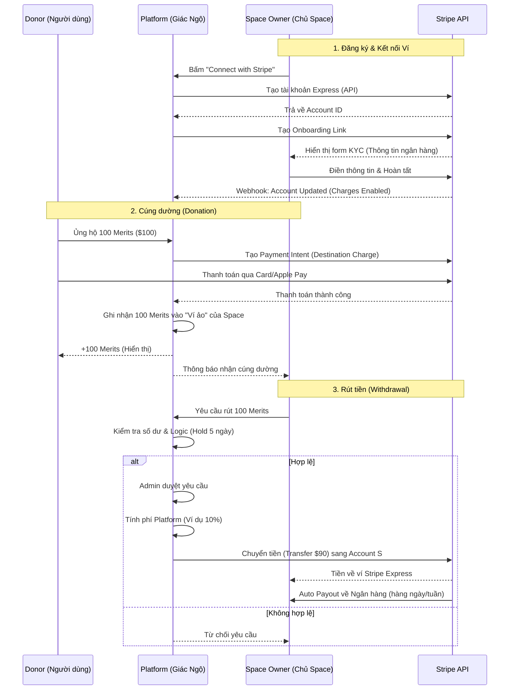

# Giác Ngộ - Không Gian Thực Hành Tâm Linh AI

**Giác Ngộ** là một nền tảng ứng dụng web toàn diện, kết hợp giữa thực hành tâm linh truyền thống và công nghệ Trí tuệ Nhân tạo (AI) tiên tiến. Ứng dụng cung cấp các không gian tu tập chuyên biệt, nơi người dùng có thể tiếp cận pháp thoại, thiền dẫn, kinh sách và đặc biệt là sự hỗ trợ từ các Trợ lý AI được huấn luyện chuyên sâu theo từng chủ đề.

*(Ảnh minh họa: Giao diện tổng quan Dashboard)*

---

## 🚀 Tính Năng Chi Tiết (Dành Cho Người Dùng)

### 1. 🧘 Không Gian Thực Hành (Practice Spaces)
Mỗi "Không gian" (Space) là một khu vực độc lập dành cho một pháp môn, một vị thầy hoặc một cộng đồng cụ thể (ví dụ: "Giác Ngộ", "Làng Mai").
*   **Giao diện tùy biến**: Mỗi không gian có thể có giao diện, logo và chủ đề màu sắc riêng biệt.
*   **Chế độ xem đa dạng**: Người dùng có thể chuyển đổi giữa các chế độ: Trò chuyện (Chat), Thư viện (Library), Cộng đồng (Community).

*(Ảnh minh họa: Giao diện một Không gian thực hành)*

### 2. 🤖 Trợ Lý AI (AI Companion)
Trái tim của ứng dụng là các AI Agent thông minh:
*   **Trò chuyện theo ngữ cảnh (Contextual Chat)**: AI hiểu và trả lời dựa trên kho dữ liệu (Kinh sách, bài giảng) riêng của từng Không gian.
*   **Đa phương thức (Multimodal)**:
    *   **Nhận dạng giọng nói (STT)**: Hỗ trợ nhập liệu bằng giọng nói tiếng Việt và tiếng Anh trực tiếp qua trình duyệt.
    *   **Đọc văn bản (TTS)**: AI có thể đọc câu trả lời bằng giọng đọc tự nhiên.
    *   **Xử lý hình ảnh & OCR**: Người dùng có thể gửi ảnh để AI phân tích, trích xuất văn bản và giải đáp.
    *   **Xử lý tài liệu**: Upload file (PDF, Docx) để AI tóm tắt hoặc trích xuất nội dung vào kho RAG.
*   **Lịch sử hội thoại**: Lưu trữ và quản lý các đoạn chat cũ, cho phép xem lại bất cứ lúc nào.

*(Ảnh minh họa: Giao diện chat với AI Agent)*

### 3. 📚 Thư Viện Pháp Bảo (Digital Library)
Kho tàng tri thức số hóa:
*   **Pháp Thoại (Dharma Talks)**: Trình phát audio/video các bài giảng pháp, hỗ trợ phân loại theo tác giả, chủ đề.
*   **Thiền Dẫn (Guided Meditations)**: Công cụ hỗ trợ hành thiền với các bài dẫn thiền được tích hợp sẵn, hỗ trợ bộ đếm giờ và nhạc nền.
*   **Kinh Sách & Tài Liệu**: Trình đọc tài liệu (Reader) tích hợp, hỗ trợ Mục lục tự động, tìm kiếm nội dung trong sách.
*   **Cộng đồng (Social Feed)**: Không gian chia sẻ, thảo luận và tương tác giữa các hành giả trong từng Không gian.

*(Ảnh minh họa: Giao diện Thư viện số)*

### 4.  Hệ Thống Merit & Marketplace
Hệ thống kinh tế nội tại hỗ trợ vận hành:
*   **Merit Token**: Đơn vị dùng để sử dụng các tính năng AI cao cấp.
*   **AI Marketplace**: Nơi người dùng khám phá và "Kích hoạt" (mua hoặc nhận miễn phí) các trợ lý AI chuyên biệt.
*   **Cúng Dường (Donation)**: Tích hợp cổng thanh toán Stripe. Hệ thống hỗ trợ theo dõi dòng tiền cúng dường chi tiết theo từng Không gian.
*   **Quản Lý Tài Chính Cá Nhân**: Người dùng xem lịch sử nạp Merits và cúng dường tại `/finance`.

*(Ảnh minh họa: Giao diện Marketplace và Ví Merits)*

---

## 🛠 Tính Năng Quản Trị (Admin System)

Hệ thống quản trị mạnh mẽ dành cho Admin và Chủ sở hữu Không gian (Space Owners).

### 1. 📊 Dashboard & Thống Kê
*   Tổng quan về số lượng người dùng, doanh thu, và mức độ sử dụng AI.
*   Biểu đồ theo dõi hoạt động theo thời gian thực.

*(Ảnh minh họa: Trang Dashboard thống kê)*

### 2. 🧠 Quản Lý AI (AI Management)
*   **Cấu hình Model**: Tùy chỉnh LLM (Google Gemini, OpenAI GPT), nhiệt độ (temperature), system prompt.
*   **Training Data (RAG)**:
    *   Upload và quản lý các tập dữ liệu huấn luyện.
    *   Liên kết tài liệu từ Thư viện vào bộ nhớ của AI.
    *   Fine-tune dữ liệu để tăng độ chính xác.
*   **Phân quyền truy cập**: Cài đặt AI công khai (Public), riêng tư (Private) hoặc yêu cầu liên hệ (Contact for Access).

*(Ảnh minh họa: Trang quản lý cấu hình AI)*

### 🔬 Quản Lý AI Chuyên Sâu (Advanced Config)
Dành cho người dùng muốn tùy chỉnh sâu hành vi của AI Agent.
*   **Data Sources (Nguồn Dữ Liệu)**:
    *   **System Prompt**: Chỉ thị cốt lõi định hình tính cách và kiến thức nền tảng của AI.
*   **Q&A Pairs**: Dữ liệu Hỏi-Đáp thủ công giúp AI học cách trả lời các câu hỏi cụ thể (Few-shot prompting). Hỗ trợ nhập liệu "Thought" để rèn luyện tư duy cho AI.
    *   **Documents (RAG)**:
        *   **File Upload**: Tải lên trực tiếp các file (PDF, DOCX, TXT...). Hệ thống tự động tóm tắt (Summarize) để tối ưu context.
        *   **Library Parsing**: Liên kết trực tiếp với sách/kinh từ Thư viện số.
    *   **Koii Network**: Gửi tác vụ huấn luyện lên mạng lưới phi tập trung Koii (Tính năng thử nghiệm).
*   **Fine-tuning (Tinh Chỉnh Model)**:
    *   Tạo các "Job" fine-tune để huấn luyện lại model gốc (Gemini/GPT) dựa trên dữ liệu Q&A đã chuẩn bị.
    *   Quản lý các phiên bản Model ID sau khi fine-tune.
*   **Tham Số Nâng Cao**:
    *   **Max Output Tokens**: Giới hạn độ dài câu trả lời.
    *   **Thinking Budget**: (Đối với các model có khả năng suy luận) Cấp hạn mức token cho quá trình "suy nghĩ" trước khi trả lời.
*   **Công Cụ Kiểm Thử (Test Chat)**:
    *   Khung chat nội bộ để Admin kiểm tra phản hồi của AI trước khi public.
    *   Tính năng "Add to Training": Chuyển đổi ngay đoạn chat thử nghiệm thành dữ liệu huấn luyện (Q&A) nếu AI trả lời đúng/sai để sửa lỗi.

*(Ảnh minh họa: Cấu hình AI chuyên sâu và RAG)*

### 3. 📂 Quản Lý Nội Dung (Content CMS)
Hệ thống CMS mạnh mẽ hỗ trợ đa ngôn ngữ (Việt/Anh) và đa phương tiện.
*   **Không Gian (Space Management)**:
    *   **Tùy biến sâu**: Quản lý Tên, Slug (URL), Màu sắc thương hiệu, Ảnh bìa.
    *   **Phân loại & Vị trí**: Gán loại hình không gian (Chùa, Thiền viện...) và địa điểm thực tế.
    *   **Thống kê & Sở hữu**: Theo dõi lượt xem, thành viên, và gán "Chủ sở hữu" (Space Owner) để chia sẻ doanh thu.
*   **Tài Liệu (Files & Documents)**:
    *   **Trình soạn thảo Rich Text**: Hỗ trợ định dạng văn bản chi tiết (Đậm, Nghiêng, Danh sách...).
    *   **Công cụ AI tích hợp**:
        *   **Auto-Translate**: Dịch tự động nội dung song ngữ (Việt <-> Anh) dùng Gemini/GPT.
        *   **Text-to-Speech (TTS)**: Tạo file âm thanh đọc truyện/kinh tự động với nhiều giọng đọc (Kore, Puck, Allo, Echo...).
        *   **OCR & Extraction**: Trích xuất văn bản từ file PDF/Ảnh scan ngay trong trình soạn thảo.
    *   **Phân loại chi tiết**: Quản lý theo Tác giả, Thể loại, Chủ đề và Thẻ (Tags).
*   **Pháp Thoại (Dharma Talks)**:
    *   Hỗ trợ đa nguồn: Upload file âm thanh trực tiếp hoặc nhúng link YouTube.
    *   Quản lý Tác giả/Diễn giả và Ảnh đại diện.
    *   Trình phát Audio tích hợp sẵn (Lưu lại tiến độ nghe).

*(Ảnh minh họa: Giao diện CMS quản lý nội dung)*

### 4. 👥 Quản Lý Người Dùng & Phân Quyền (RBAC)
*   **User Management**:
    *   Xem danh sách, tìm kiếm, lọc theo trạng thái/quyền.
    *   Chỉnh sửa thông tin cá nhân, Merits (xu), và trạng thái hoạt động.
    *   Quản lý mật khẩu: Admin có thể reset hoặc thay đổi mật khẩu trực tiếp cho người dùng.
    *   Tạo người dùng mới thủ công.
*   **Role Management (Phân Quyền Chi Tiết)**:
    *   Tạo các nhóm quyền tùy chỉnh (Ví dụ: Editor, Moderator, Support).
    *   **Granular Permissions**: Cấp quyền truy cập chi tiết từng module (Dashboard, Files, AI, Finance, Settings...).
    *   Đảm bảo bảo mật và giới hạn truy cập đúng chức năng.

*(Ảnh minh họa: Phân quyền và quản lý người dùng)*

### 5. 💰 Tài Chính & Billing
*   **Lịch sử Giao dịch (Global Transactions)**:
    *   Theo dõi toàn bộ dòng tiền: Cúng dường (Donation/Offering).
    *   Phân loại rõ ràng nguồn tiền và người thực hiện.
*   **Yêu cầu Rút tiền (Withdrawals)**:
    *   Quy trình xét duyệt rút tiền minh bạch dành cho các Space Owner.
    *   Hỗ trợ trạng thái xử lý: Chờ duyệt (Pending) -> Đã duyệt (Approved) / Từ chối (Rejected).
*   **Space Owner Dashboard**: Giao diện tài chính chuyên biệt cho chủ sở hữu không gian để quản lý doanh thu và số dư riêng biệt.
    *   Cung cấp link **"View Payout Dashboard"** để chủ Space xem chi tiết tiền về, các khoản phí và lịch sử chuyển khoản ngay trên giao diện Stripe.
*   **Cấu hình Gói cước**: Quản lý các gói đăng ký (Pricing Plans) và quyền lợi đi kèm.

*(Ảnh minh họa: Hệ thống Billing và Rút tiền)*

### 6. ⚙️ Hệ Thống & Cài Đặt (System Settings)
*   **Guest Control**: Giới hạn số tin nhắn cho người dùng vãng lai (Guest) để tránh spam.
*   **API Keys Cá Nhân**:
    *   Quản lý key riêng cho từng model (Gemini, Vertex, GPT, Grok) để tách biệt chi phí hoặc tăng limit.
    *   Tạo **Personal Access Token** để tích hợp với các ứng dụng bên thứ 3.
*   **Cấu hình Giao diện**: Tùy chỉnh Logo, tên hiển thị cho các template khác nhau.

*(Ảnh minh họa: Cài đặt hệ thống)*

---

## 💻 Công nghệ Sử dụng (Tech Stack)

### 7. 🔗 Stripe Connect Integration Flow

Hệ thống sử dụng **Stripe Connect Express** để kết nối trực tiếp giữa:
*   **Donor (Người cúng dường)**.
*   **Platform (Giác Ngộ)**: Nơi trung gian xử lý thanh toán và thu phí.
*   **Space Owner (Chủ Không gian)**: Người thụ hưởng cuối cùng.

#### 🔄 Quy trình hoạt động (Workflow)

#### Chi tiết các bước:
1.  **Space Onboarding (Kết nối ví)**:
    *   Chủ Space truy cập vào **Ví Space** -> **Connect with Stripe**.
    *   Hệ thống gọi API tạo tài khoản **Stripe Express** và chuyển hướng người dùng sang trang của Stripe để điền thông tin ngân hàng/CCCD.
    *   Sau khi hoàn tất, tài khoản Stripe của Space sẽ được liên kết với Platform.

2.  **Donation Flow (Dòng tiền cúng dường)**:
    *   Khi người dùng cúng dường, tiền **được giữ tại tài khoản Platform** chứ chưa chuyển ngay cho Space.
    *   Hệ thống ghi nhận số dư dưới dạng **Merits** trong "Ví ảo" của Space trên ứng dụng.

3.  **Automated Payouts (Rút tiền tự động)**:
    *   **Yêu cầu (Request)**: Space Owner tạo yêu cầu rút tiền từ Dashboard.
    *   **Duyệt (Approval)**: Admin xem xét và duyệt yêu cầu.
    *   **Chuyển tiền (Transfer)**: Ngay khi duyệt, hệ thống tự động trích tiền từ tài khoản Platform -> chuyển sang tài khoản Stripe Express của Space (đã trừ phí nền tảng).
    *   **Về ngân hàng**: Từ Stripe Express, tiền sẽ tự động được chuyển về tài khoản ngân hàng của Space Owner theo lịch định kỳ.

### Frontend
*   **React.js (Vite)** + **TypeScript**
*   **Tailwind CSS** (Styling)
*   **Framer Motion** (Animations)

### Backend
*   **Node.js (Express)**: Server điều phối chính.
*   **PostgreSQL**: Cơ sở dữ liệu quan hệ chính.
*   **Supabase**: Quản lý database và xác thực.
*   **Weaviate**: Vector Database phục vụ tìm kiếm ngữ cảnh (RAG).

### AI & APIs
*   **LLMs**: Google Gemini (Flash/Pro), OpenAI GPT-4o, Grok.
*   **Payment**: Stripe API.
*   **Blockchain**: Koii Network (Decentralized AI tasks).

---

## 📡 Tài Liệu API (API Docs)

### 🔐 Xác Thực (Authentication - `/auth`)
*   `POST /login`: Đăng nhập hệ thống.
*   `POST /register`: Đăng ký tài khoản mới.
*   `POST /forgot-password`: Yêu cầu đặt lại mật khẩu.
*   `POST /reset-password`: Thực hiện đặt lại mật khẩu với token.
*   `GET /auth/google`: Bắt đầu đăng nhập Google OAuth.

### 👤 Người Dùng (`/users`)
*   `GET /`: Lấy danh sách người dùng (Cần quyền Admin).
*   `GET /space-owners`: Lấy danh sách chủ sở hữu không gian.
*   `PUT /:id`: Cập nhật thông tin profile người dùng.
*   `POST /change-password`: Đổi mật khẩu cá nhân.
*   `POST /:id/regenerate-token`: Tạo lại API token cho người dùng.

### 🌏 Không Gian (`/spaces`)
*   `GET /`: Lấy danh sách tất cả không gian.
*   `GET /:slug`: Lấy thông tin chi tiết một không gian theo đường dẫn (slug).
*   `POST /`: Tạo không gian mới (Admin).
*   `PUT /:id`: Cập nhật thông tin không gian.
*   `POST /:id/view`: Tăng lượt xem cho không gian.
*   `POST /:id/offer`: Thực hiện cúng dường/ủng hộ cho không gian.

### 📚 Thư Viện & Tài Liệu
#### Library View (`/library`)
*   `GET / sidebar`: Lấy cấu trúc danh mục cho sidebar thư viện.
*   `GET /documents`: Lấy danh sách tài liệu hiển thị trong thư viện.
*   `GET /documents/:id`: Lấy nội dung chi tiết của tài liệu.

#### Quản Lý Tài Liệu (`/documents`)
*   `POST /`: Upload tài liệu mới.
*   `POST /extract-text`: API trích xuất văn bản (OCR) từ file upload.
*   `PUT /:id`: Cập nhật metadata tài liệu.
*   `DELETE /:id`: Xóa tài liệu.
*   **Danh mụ**: `/authors` (Tác giả), `/types` (Thể loại), `/topics` (Chủ đề).

### 🧘 Nội Dung Tu Tập
#### Pháp Thoại (`/dharma-talks`)
*   `GET /`: Lấy danh sách pháp thoại.
*   `POST /`: Tạo mới pháp thoại (Upload Audio/Avatar).
*   `POST /:id/view`: Ghi nhận lượt nghe.

#### Thiền (`/meditations`)
*   `GET /space/:spaceId`: Lấy danh sách bài thiền của một không gian.
*   `POST /`: Tạo bài dẫn thiền mới.

### 💬 AI & Trò Chuyện
#### Conversations (`/conversations`)
*   `POST /chat/stream`: Gửi tin nhắn và nhận phản hồi dạng stream (từng chữ).
*   `GET /`: Lấy danh sách hội thoại của người dùng.
*   `POST /:conversationId/messages/:messageId/feedback`: Gửi phản hồi (Like/Dislike) cho tin nhắn của AI.
*   `PUT /:id/rename`: Đổi tên cuộc trò chuyện.

#### AI Configuration (`/ai-configs`)
*   `POST /`: Lấy danh sách AI khả dụng cho người dùng.
*   `POST /create`: Tạo cấu hình AI mới (New Persona).
*   `POST /:id/training-data`: Link dữ liệu training cho AI.
*   `POST /:id/documents`: Gán tài liệu RAG cho AI.
*   `POST /:id/purchase`: Mua quyền truy cập AI.

### ⚙️ Hệ Thống & Tiện Ích (`/`)
*   `GET /system-config`: Lấy cấu hình toàn hệ thống.
*   `POST /upload`: Upload file chung (ảnh, đính kèm).
*   `POST /translate`: Dịch thuật văn bản.
*   `POST /tts/generate`: Tạo file âm thanh từ văn bản (Text-to-Speech).

### 💳 Thanh Toán (`/`)
*   `GET /pricing-plans`: Lấy bảng giá gói cước.
*   `POST /subscriptions/purchase`: Mua gói đăng ký.
*   `POST /stripe/create-checkout-session`: Tạo phiên thanh toán Stripe.
*   `POST /crypto/initiate-merit-purchase`: Bắt đầu giao dịch mua Merit bằng Crypto.
*   `POST /withdrawals`: Tạo yêu cầu rút tiền.

---

## ✅ Checklist Chi Tiết Chức Năng Website
✅ Checklist Chi Tiết Chức Năng Website

Dùng để theo dõi tiến độ triển khai. Ký hiệu: ✅ Đã hoàn thành | 🔲 Chưa làm | 🔧 Đang làm

---

1. 🏛️ WEBSITE CHÙA (Space)

1.1 Giao diện & Nhận diện thương hiệu
- ✅ Không gian số riêng với thương hiệu (logo, màu sắc)
- ✅ Tên Slug riêng (ví dụ: giac.ngo/tathata)
- ✅ Ảnh bìa & banner riêng cho từng Space
- ✅ Thông tin liên hệ của chùa / thiền viện
- ✅ Lịch sự kiện của từng Space
1.2 Nội dung tu tập
- ✅ Thư viện bài giảng & kinh sách
- ✅ Audio Pháp thoại (upload file hoặc nhúng YouTube)
- ✅ Thiền dẫn (Guided Meditation) có bộ đếm giờ & nhạc nền
- 🔲 Video pháp thoại (nhúng & phát trực tiếp)
- 🔲 Lịch tu học định kỳ (online/offline)
1.3 Cộng đồng
- 🔲 Social Feed (chia sẻ, thảo luận giữa hành giả)
- 🔲 Thông báo sự kiện đẩy (Push Notification)
- 🔲 Forum / Hỏi-đáp cộng đồng

---

2. 🤖 TRỢ LÝ AI

2.1 Hạ tầng AI cốt lõi
- ✅ Chatbot RAG (upload tài liệu → AI học → trả lời)
- ✅ Hỗ trợ nhiều mô hình AI (Gemini Flash/Pro, GPT-4o, Grok)
- ✅ Huấn luyện trên tài liệu riêng của chùa (RAG)
- ✅ Knowledge base Phật giáo cố định (pre-loaded, không cần upload)
- ✅ Hỗ trợ tiếng Việt & tiếng Anh
2.2 Đa phương thức (Multimodal)
- ✅ Nhận dạng giọng nói – STT (nói → text)
- ✅ Đọc to câu trả lời – TTS (text → giọng đọc)
- ✅ Xử lý hình ảnh & OCR (gửi ảnh → AI phân tích)
- ✅ Xử lý tài liệu (Upload PDF, DOCX → AI tóm tắt / đưa vào RAG)
2.3 Chất lượng & Kiểm soát
- ✅ Lịch sử hội thoại & phản hồi chất lượng AI (Like/Dislike)
- ✅ Đo lường sử dụng (token, billing per user)
- ✅ System Prompt tùy chỉnh (định hình tính cách AI)
- ✅ Q&A Pairs thủ công (Few-shot prompting, hỗ trợ "Thought")
- ✅ Công cụ Test Chat nội bộ (Admin kiểm tra trước khi public)
- ✅ Tính năng "Add to Training" từ Test Chat
- ✅ Phân quyền truy cập AI: Public / Private / Contact for Access
- ✅ Max Output Tokens & Thinking Budget
2.4 Cải tiến nâng cao (Advanced)
- ✅ Train Weaviate (Button gửi Koii network)
- 🔲 Multi-agent (nhiều AI hợp tác trả lời)
- 🔲 Memory dài hạn giữa các phiên chat

---

3. 💰 HỆ THỐNG CÚNG DƯỜNG & THANH TOÁN

3.1 Cúng dường
- ✅ Tích hợp Stripe – thanh toán bằng thẻ / Apple Pay / Google Pay
- ✅ Theo dõi dòng tiền cúng dường theo từng Space
- ✅ Lịch sử giao dịch (Donation / Offering)
- ✅ Thông báo nhận cúng dường cho Space Owner
3.2 QR Code Cúng Dường (Thanh toán nội địa)
Phương thức thanh toán bổ sung bên cạnh Stripe, phù hợp với ngân hàng Việt Nam
- 🔲 Mỗi Space cấu hình QR code riêng (upload ảnh QR hoặc nhập số tài khoản → auto generate VietQR)
- 🔲 Giao diện cúng dường hiển thị QR + số tiền gợi ý
- 🔲 Người dùng upload ảnh bill xác nhận sau khi chuyển khoản (xác nhận thủ công)
- 🔲 (Nâng cao) Tích hợp VietQR webhook → tự động xác nhận giao dịch & cộng Merit
- 🔲 Logic Merit: User đã login → cộng Merit sau xác nhận | Guest → không cộng, hiển thị CTA mời đăng ký
3.2 Merit & Marketplace
- ✅ Merit Token – đơn vị nội tại để dùng tính năng AI
- ✅ AI Marketplace – kích hoạt / mua AI chuyên biệt
- ✅ Mua Merit bằng Crypto (initiate-merit-purchase)
- 🔲 Mua Merit bằng chuyển khoản ngân hàng nội địa
3.3 Stripe Connect & Rút tiền
- ✅ Stripe Connect Express – Space Owner kết nối ví
- ✅ Onboarding KYC (thông tin ngân hàng / CCCD trên Stripe)
- ✅ Quy trình duyệt rút tiền: Pending → Approved / Rejected
- ✅ Tự động chuyển tiền (Transfer) sau khi Admin duyệt
- ✅ Space Owner Dashboard – xem doanh thu & số dư
- ✅ Link "View Payout Dashboard" trên giao diện Stripe

---

4. 👥 QUẢN LÝ THÀNH VIÊN

4.1 Tài khoản người dùng
- ✅ Đăng ký / đăng nhập (Email + Password)
- 🔲 Đăng nhập Google OAuth (phải có GOOGLE_CLIENT_ID, GOOGLE_CLIENT_SECRET)
- ✅ Quên mật khẩu / Đặt lại mật khẩu (token qua email)
- ✅ Hồ sơ thành viên (Profile)
- ✅ Đổi mật khẩu cá nhân
- ✅ Upload avatar (ảnh đại diện)
- ✅ Personal Access Token để tích hợp API bên thứ 3
4.2 Phân quyền (RBAC)
- ✅ Các vai trò: Admin / Space Owner / Editor / Moderator / User / Guest
- ✅ Granular Permissions theo từng module (Dashboard, Files, AI, Finance...)
- ✅ Tạo nhóm quyền tùy chỉnh
- ✅ Guest Control – giới hạn số tin nhắn cho người vãng lai
4.3 Quản lý người dùng (Admin)
- ✅ Danh sách, tìm kiếm, lọc người dùng
- ✅ Chỉnh sửa thông tin, Merits, trạng thái
- ✅ Reset / thay đổi mật khẩu người dùng (Admin)
- ✅ Tạo người dùng mới thủ công
- ✅ Gán Space Owner và chia sẻ doanh thu

---

5. 📚 QUẢN LÝ NỘI DUNG (CMS)

5.1 Tài liệu & Kinh sách
- ✅ Rich Text Editor (Đậm, Nghiêng, Danh sách...)
- ✅ Auto-Translate song ngữ Việt ↔ Anh (Gemini/GPT)
- ✅ TTS – tạo file âm thanh từ nội dung (nhiều giọng đọc)
- ✅ OCR & Extraction từ PDF / ảnh scan
- ✅ Phân loại theo Tác giả, Thể loại, Chủ đề, Tags
- ✅ Trình đọc tài liệu tích hợp (Mục lục tự động, tìm kiếm)
5.2 Pháp thoại & Thiền dẫn
- ✅ Upload audio trực tiếp / nhúng YouTube
- ✅ Quản lý Tác giả / Diễn giả và Ảnh đại diện
- ✅ Trình phát Audio lưu tiến độ nghe
- ✅ Bài dẫn thiền + bộ đếm giờ + nhạc nền
5.3 Quản lý Space (Admin)
- ✅ Tên, Slug, Màu sắc, Ảnh bìa
- ✅ Phân loại (Chùa, Thiền viện...) và địa điểm thực tế
- ✅ Theo dõi lượt xem, số thành viên

---

6. 📊 DASHBOARD & THỐNG KÊ

- ✅ Tổng quan người dùng, doanh thu, mức dùng AI
- ✅ Biểu đồ hoạt động theo thời gian thực
- ✅ Thống kê token / billing theo người dùng
- 🔲 Xuất báo cáo (Excel / PDF)
- 🔲 Cảnh báo bất thường (dùng quá mức, giao dịch lạ)

---

7. ⚙️ HỆ THỐNG & CÀI ĐẶT

7.1 Cài đặt hệ thống
- ✅ Cấu hình Logo, tên hiển thị theo template
- ✅ Quản lý API Keys cá nhân (Gemini, Vertex, GPT, Grok)
- ✅ Gemini Voice cho TTS (chọn giọng đọc)
- ✅ Cấu hình gói cước (Pricing Plans) và quyền lợi
- ✅ Custom Modal thay thế alert / confirm (UX mượt mà)
7.2 Bảo mật & Độ tin cậy
- ✅ JWT-based Authentication
- ✅ Role-based Access Control (RBAC) phân quyền sâu
- ✅ Stripe Webhook xác thực giao dịch
- 🔲 2FA (Xác thực hai yếu tố)
- 🔲 Audit Log (theo dõi hành động Admin)
